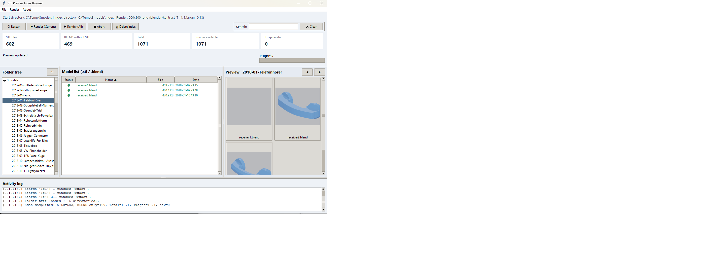

# STL Preview Index Renderer (Python)

Ein Tool mit zwei Modi:

- GUI-Modus (ohne Parameter): Verzeichnis-Browser mit Modell-Liste (`.stl`/`.blend`) und Thumbnail-Vorschau
- CLI-Modus (mit Parametern): rendert Vorschaubilder rekursiv ins Indexverzeichnis

## Screenshot



## Projektstruktur

- `stl_index_renderer.py`: Entry-Point (CLI + GUI-Start)
- `gui_app.py`: Kompatibilitäts-Wrapper für GUI-Start
- `gui/app.py`: schlanker GUI-Entry-Point
- `gui/window.py`: Hauptlogik der Tkinter-Oberfläche
- `gui/models.py`: GUI-Datenklassen
- `gui/utils.py`: GUI-Hilfsfunktionen
- `renderers.py`: Blender/PyVista/Matplotlib-Renderer
- `scanner.py`: STL-Scan, Summary, Pfadlogik
- `config_store.py`: Laden/Speichern der Konfiguration
- `constants.py`: gemeinsame Konstanten

## Installation

```bash
python3 -m venv .venv
source .venv/bin/activate
pip install pyvista matplotlib numpy-stl
```

Hinweis:
- Standard-Renderer ist `blender`.
- Alternativen sind `pyvista` und `matplotlib` (über Einstellungen oder CLI).
- Blender wird erkannt über:
  - konfigurierten Blender-Pfad in den GUI-Einstellungen oder
  - `blender` im `PATH` oder
  - typische Windows-Installationspfade.

## GUI-Modus

Start ohne Parameter:

```bash
python3 stl_index_renderer.py
```

Verhalten:

- Beim ersten Start wirst du nach einem Startverzeichnis gefragt.
- Danach wird automatisch das zuletzt verwendete Startverzeichnis genutzt.
- Das Default-Indexverzeichnis ist `Index` unterhalb des Startverzeichnisses.
- Initialer Scan läuft im Hintergrund mit Status-/Busy-Anzeige (GUI bleibt bedienbar).
- Scan-Ergebnis wird im Indexverzeichnis als Cache gespeichert (`.stlpreview_scan_cache.json`).
- Automatischer Neu-Scan wird nur gestartet, wenn kein Cache vorhanden ist oder der Cache älter als 3 Tage ist.
- `Neu scannen` erzwingt immer einen frischen Scan.
- Über `Datei -> Einstellungen...` kannst du Indexverzeichnis, Renderauflösung und Bildformat konfigurieren.
- Über `Datei -> Einstellungen...` kannst du zusätzlich Renderer und optional den Blender-Pfad konfigurieren.
- Über `Datei -> Einstellungen...` kannst du zusätzlich ein Blender-Look-Preset wählen (`neutral`, `kontrast`, `dunkelblau`).
- Über `Datei -> Einstellungen...` kannst du zusätzlich die Anzahl Render-Threads konfigurieren (Default: `4`).
- Über `Datei -> Einstellungen...` kannst du zusätzlich den Bildrand (`0.00` bis `1.00`) für den Kameraausschnitt einstellen.
- Im Kopfbereich werden angezeigt:
  - Anzahl STL-Dateien
  - Anzahl Blender-Dateien ohne passende STL-Datei
  - Gesamtanzahl der renderbaren Modelle
  - Anzahl bereits vorhandener Bilder
  - Anzahl Bilder, die neu erzeugt werden müssten
- Zusätzlich gibt es eine eigene Aktivitätszeile mit Fortschrittsbalken.
- Im Fußbereich zeigt ein mehrzeiliges Aktivitätsprotokoll laufende Schritte und Fehler (z. B. Blender nicht gefunden, Dateifehler).
- Links: Ordnernavigation unterhalb des Startverzeichnisses
- Rechts:
  - Modell-Liste (`.stl` und `.blend`; Name, Größe, Datum)
  - Thumbnail-Vorschau aus dem Indexverzeichnis
- Suchfeld in der Toolbar:
  - durchsucht alle Verzeichnisse nach passenden Modellen
  - bei keinen Exakt-Treffern wird fuzzy (typo-tolerant) gesucht
  - passende Ordner werden in der Ordnerstruktur fett dargestellt
  - die Modell-Liste zeigt nur gefilterte Treffer
- Menü `Datei`:
  - `Startverzeichnis ändern...`
  - `Einstellungen...`
  - `Neu scannen`
  - `Lösche Index` (löscht das konfigurierte Indexverzeichnis nach Bestätigung)
- Menü `Rendern`:
  - `Starten (gesamtes Startverzeichnis)`
  - `Starten (aktuelles Verzeichnis)`
  - `Abbrechen`

Hinweis:

- Der Thumbnail-Aufbau erfolgt schrittweise mit Fortschrittsanzeige.

## CLI-Modus

Beispiel:

```bash
python3 stl_index_renderer.py \
  --source . \
  --index-dir ./index \
  --width 500 \
  --height 300 \
  --ext .png \
  --verbose
```

Optionen:

- `--source`: Quellverzeichnis (Default: aktuelles Verzeichnis)
- `--index-dir`: Zielverzeichnis für Bilder (Default: `./index`)
- `--width`: Bildbreite in Pixel (Default: `500`)
- `--height`: Bildhöhe in Pixel (Default: `300`)
- `--ext`: Ausgabeformat (`.png`, `.jpg`, `.jpeg`, `.webp`)
- `--renderer`: `blender`, `pyvista`, `matplotlib`
- `--blender-path`: optionaler Pfad zur lokalen Blender-Executable
- `--blender-preset`: `neutral`, `kontrast`, `dunkelblau`
- `--framing-margin`: zusätzlicher Rand um das Objekt (`0.0` bis `1.0`, Default `0.18`)
- GUI-Rendering läuft parallel mit konfigurierbarer Thread-Anzahl (Default `4`).
- `--overwrite`: Erzwingt Neurendern aller Bilder
- `--verbose`: Zeigt jede verarbeitete Datei

## Hinweis

- Für Rendering wird pro Modellname (`Ordner + Dateiname ohne Endung`) bevorzugt `*.stl` verwendet.
- Existiert keine STL, wird `*.blend` gerendert.

## Spenden

Wenn dir das Projekt hilft und du es unterstützen möchtest, sind Spenden willkommen:

- Kontakt: `herrler@buschtrommel.net`
